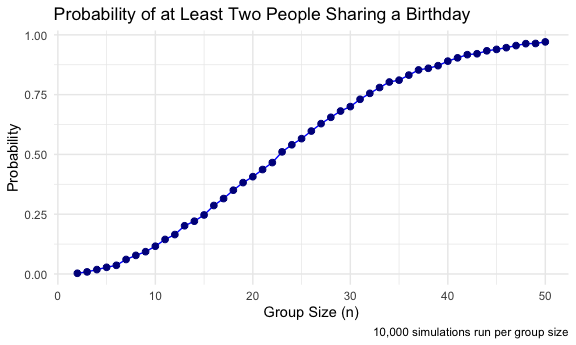
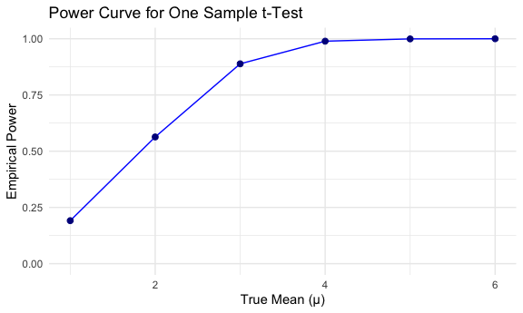
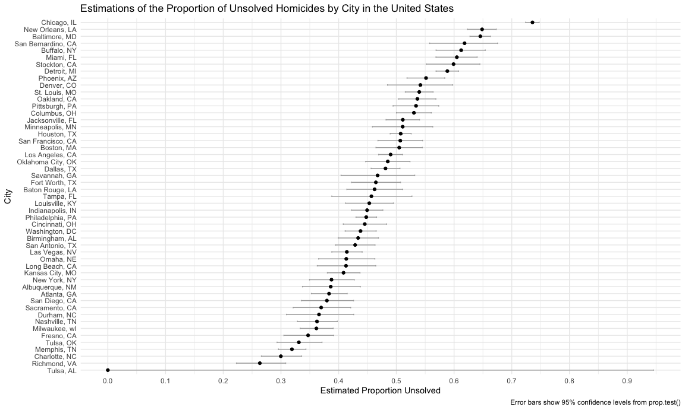

HW5: Iteration
================
Maya Arnott
2025-11-12

## Problem 1: The birthday simulation

I want to first create a function to simulate if at least two people
share a birthday.

``` r
bday_share = function(n_ppl) {
  bdays = sample(1:365 , size = n_ppl, replace = TRUE)
  
  any(duplicated(bdays))
}
```

Now I will run the simulation 10,000 times for each group size between 2
and 50.

``` r
set.seed(2025)

n_simulation = 10000
group_sizes = 2:50
```

For each group, I will compute the probability of a shared birthday

``` r
results = map_dfr(group_sizes, function(n) {
  
  prob = replicate(n_simulation, bday_share(n))
  tibble(group_size = n, prob_shared = mean(prob))
         
})
```

I will plot my results.

``` r
ggplot(results, aes(x = group_size, y = prob_shared)) +
  geom_line(color = "blue") + 
  geom_point(color = "darkblue", size = 2) + 
  labs(
    title = "Probability of at Least Two People Sharing a Birthday",
    x = "Group Size (n)",
    y = "Probability",
    caption = "10,000 simulations run per group size"
  )
```



The probability that two people share a birthday quickly rises as the
group size (n) increases. With a group size of 23, the probability
exceeds 0.50, which means that it is more likely than not that two
people share a birthday when `n` is 23 or above.

## Problem 2: Power simulation using a one-sample t-test

First, I will define my parameters.

``` r
n = 30
mu = 0
sigma = 5
n_sim = 5000
```

Now I will define the function and run the simulation.

``` r
t_results = map_dfr(1:n_sim, function(i){
  
  # to generate one dataset
  x = rnorm(n, mean = mu, sd = sigma)
  
  # to run a one sample t-test for H0
  test_out = t.test(x, mu = 0) 
    
  # to extract the estimate and p-value with broom::tidy
  tidy(test_out) |>
    select(estimate, p.value) |> 
    mutate(sim = i)
  
  }  
)

# checking the first couple rows
head(results)
```

    ## # A tibble: 6 × 2
    ##   group_size prob_shared
    ##        <int>       <dbl>
    ## 1          2      0.003 
    ## 2          3      0.0088
    ## 3          4      0.0183
    ## 4          5      0.0279
    ## 5          6      0.0363
    ## 6          7      0.0607

I will estimate the probability of rejecting the null (power).

``` r
power_estimate = t_results |> 
  summarize(power = mean(p.value < 0.05)) |> 
  pull(power)

power_estimate
```

    ## [1] 0.0484

Now, I will explore power for different true means by looping over my
vector `{1,2,3,4,5,6}`

``` r
mu_values = 1:6

power_results = map_dfr(mu_values, function(mu_true){
  
  # run simulations for the new mu
  map_dfr(1:n_sim, function(i) {
    x = rnorm(n, mean = mu_true, sd = sigma)
    
  # another one sample t-test against H0
    t.test(x, mu = 0) |> 
      tidy() |> 
      select(estimate, p.value) |> 
      mutate(sim = i, mu_true = mu_true)
    }
  )
  
  }
)
# checking the first couple of rows
head(power_results)
```

    ## # A tibble: 6 × 4
    ##   estimate p.value   sim mu_true
    ##      <dbl>   <dbl> <int>   <int>
    ## 1    1.72   0.0253     1       1
    ## 2    1.91   0.0626     2       1
    ## 3    0.551  0.631      3       1
    ## 4    0.899  0.302      4       1
    ## 5    2.20   0.0844     5       1
    ## 6    0.886  0.262      6       1

I will compute the empirical power for each true mean.

``` r
power_mu = power_results |> 
  group_by(mu_true) |> 
  summarize(power = mean(p.value < 0.05))

power_mu
```

    ## # A tibble: 6 × 2
    ##   mu_true power
    ##     <int> <dbl>
    ## 1       1 0.191
    ## 2       2 0.563
    ## 3       3 0.889
    ## 4       4 0.989
    ## 5       5 0.999
    ## 6       6 1

I will now plot the power curve.

``` r
ggplot(power_mu, aes(x = mu_true, y = power)) + 
  geom_line(color = "blue") + 
  geom_point(color = "darkblue", size = 2) + 
  scale_y_continuous(limits = c(0,1)) +
  labs(
    title = "Power Curve for One Sample t-Test",
    x = "True Mean (μ)",
    y = "Empirical Power")
```



We see that power increases as the true mean moves further away from 0.
The smaller the true mean, the greater the empirical power increases. In
other words, we see the curve rise quickly at first, and approach 1 as
it becomes large enough that the null is almost always rejected. This
demonstrates a key statistical principle: larger effect sizes (the true
difference between the population mean and the null hypothesis value)
make it easier to detect differences.

Now I will explore how selection bias could influence my results.

First, I will compute the averages.

``` r
avg_estimates = power_results |> 
  group_by(mu_true) |> 
  summarize(
    avg_all = mean(estimate),
    avg_rejected = mean(estimate[p.value < 0.05])
  )
```

Then, I will plot them.

``` r
ggplot(avg_estimates, aes(x = mu_true)) +
  geom_line(aes(y = avg_all, color = "All simulations")) +
  geom_point(aes(y = avg_all, color = "All simulations"), size = 2) +
  geom_line(aes(y = avg_rejected, color = "Rejected null"), linetype = "dashed") +
  geom_point(aes(y = avg_rejected, color = "Rejected null"), size = 2) +
  labs(
    title = "Comparison of Avg. Sample Mean vs. True Mean",
    x = "True Mean (μ)",
    y = "Average Sample Mean (μ̂)",
    color = ""
  )
```


Looking at all simulations, indicated by the solid line, the average of
the sample mean is very close to the true mean, which is expected per
the law of large numbers. Looking at only the rejected null, the average
of the sample mean is slightly larger than the true mean. This is
particularly true at smaller effect sizes. There is a selection bias at
small effect sizes, because the t-test will only rejet the null if the
observed sample mean is unusually large due to random variation. Thus,
the sample mean trends to overestimate the true mean.

## Problem 3: Prop.test() using The Washington Post’s homicide dataset

First, I will load and tidy the homicide dataset.

``` r
homicide_df = 
  read_csv("./data/homicide-data.csv") |> 
  janitor::clean_names() 
```

    ## Rows: 52179 Columns: 12
    ## ── Column specification ────────────────────────────────────────────────────────
    ## Delimiter: ","
    ## chr (9): uid, victim_last, victim_first, victim_race, victim_age, victim_sex...
    ## dbl (3): reported_date, lat, lon
    ## 
    ## ℹ Use `spec()` to retrieve the full column specification for this data.
    ## ℹ Specify the column types or set `show_col_types = FALSE` to quiet this message.

The Washington Post collected data on more than 52,000 criminal
homicides over the past decade in 50 of America’s largest cities. The
raw data has `report_date`, indicating the day the killing was reported,
`victim_last` and `victim_first`, indicating the first and last name of
the victim. There are also columns identifying the victim’s demographic
characteristics, such as `victim_age`, `victim_race`, and `victim_sex`.
The location of the crime is identified in `city`, `state`, and `lat`
and `lon`. The `disposition` column indicates whether the case has been
solved or unsolved (closed without arrest or open/no arrest).

I will combine `city` and `state` to create a `city_state` variable. I
will also summarize within cities to obtain the number of homicides.

``` r
homicide_df = homicide_df |> 
  mutate(
    city_state = paste(city, state, sep = ", ")
  )

homicide_df = homicide_df |> 
  mutate( 
    unsolved = disposition %in% c("Closed without arrest",
                                  "Open/No arrest")
    ) |> 
  group_by(city_state) |> 
  summarize(
    total_homicides = n(), 
    unsolved_homicides = sum(unsolved),
    .groups = "drop"
  )
```

I will use the `prop.test` function to estimate the proportion of
homicides unsolved in Batlimore, MD.

``` r
baltimore_data = 
  homicide_df |> 
  filter(city_state == "Baltimore, MD")

balt_prop_test = 
  prop.test(
    x = baltimore_data |> pull(unsolved_homicides),
    n = baltimore_data |> pull(total_homicides)
  )

balitmore_tidy = 
  broom::tidy(balt_prop_test) |> 
  select(estimate, conf.low, conf.high)
```

Now, I will use the `prop.test` function for every city ansd extract the
proportion & confidence level.

``` r
city_prop_test = 
  homicide_df |> 
  mutate(
    
    test = purrr::map2(
      unsolved_homicides, 
      total_homicides,
      ~ prop.test(x = .x, n = .y)
    ),
    
    tidy_test = purrr::map(test, broom::tidy)
  ) |> 
  
  unnest(tidy_test) |> 
  
  select(
    city_state, 
    estimate, 
    conf.low, 
    conf.high
  )
```

I will create a plot showing the estimates and confidence intervals for
each city.

``` r
ggplot(city_prop_test, aes(
      x = estimate, 
      y = fct_reorder(city_state, estimate))
      ) +
  geom_errorbarh(aes(
      xmin = conf.low, 
      xmax = conf.high), 
      color = "darkgray",
      height = 0.2) +
  geom_point() +
  labs(
      title = "Estimations of the Proportion of Unsolved Homicides by City in the United States",
      x = "Estimated Proportion Unsolved",
      y = "City",
      caption = "Error bars show 95% confidence levels from prop.test()"
  ) +
  scale_x_continuous(breaks = seq(0, 1, 0.1))
```


